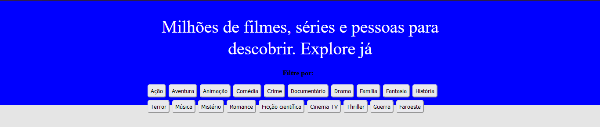
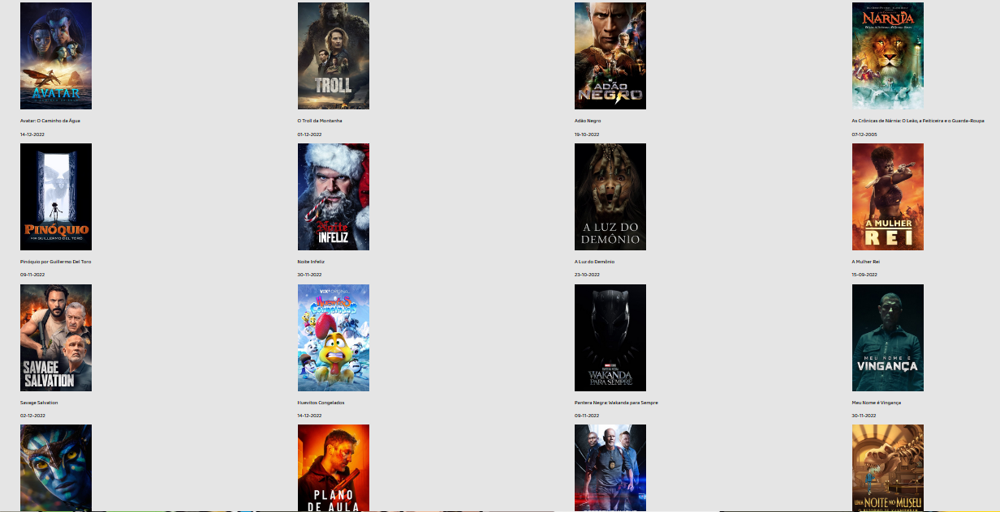
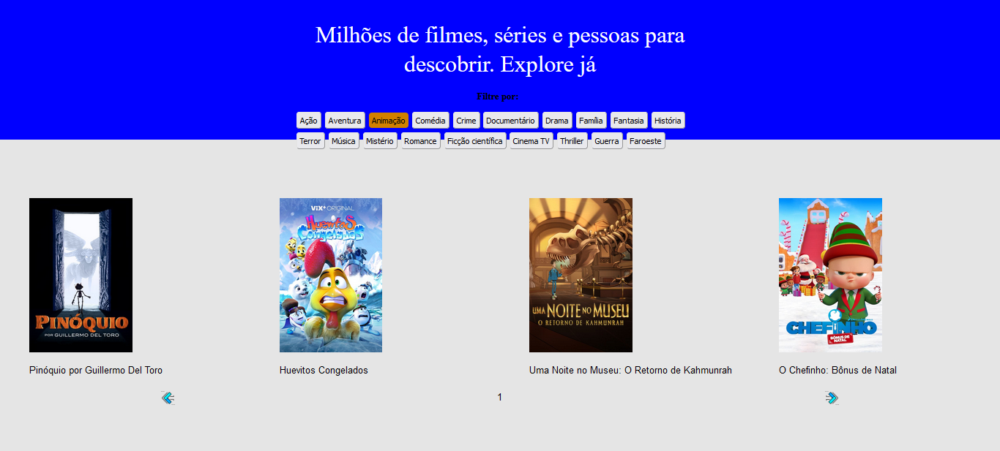
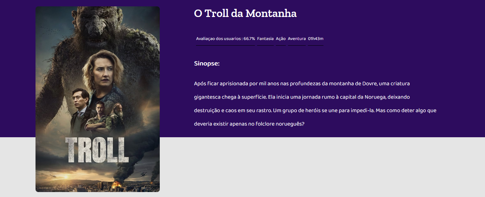
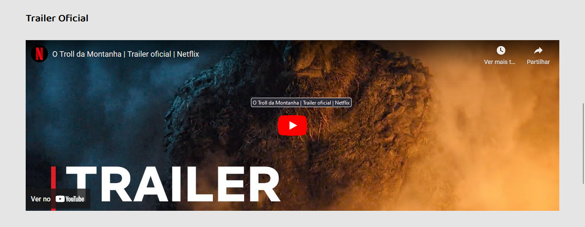

# Case Legado I- Promobit (Front-End)

Listagem de Filmes com a api TheMovieDB

## Indice
- <a href="-funcionalidades-do-projeto"> Funcionalidades do Projeto</a>
- <a href="-descrição"> O Desafio </a>
- <a href="-layout"> Layout </a>
- <a href="-demonstração-do-projeto"> Demonstração do Projeto </a>
- <a href="-como-rodar-esse-projeto"> Como rodar esse projeto? </a>
- <a href="-tecnologias-utilizadas"> Tecnologias Utilizadas </a>

## Funcionalidades do Projeto

- [x] Filtro
- [x] Listagem de Filmes
- [x] Mudança de Pagina
- [x] Detalhes dos Filmes
- [x] Mudança de Pagina

## Layout








##  O Desafio
Usando uma API de filmes gratuitos themoviedb em sua versão 3, você será responsável por criar uma lista dos filmes mais populares do dia, consultando o endpoint GET /movie/popularpara realizar uma lista. Ao clicar em um item dessa lista, outra página com os detalhes do filme escolhido deve ser exibida. Para acessar mais detalhes sobre o filme, você pode consultar o endpoint GET /movie/{movie_id}.

Para garantir que o usuário encontre o filme que está procurando, essa lista deve ser paginada.

### Layout Disponibilizado
[Link do Figma](https://www.figma.com/file/rM7WPqhLY9ObnGzSCeWLxB/Teste-Front-End?node-id=0%3A1&t=5NJO0cu4u8YC7VrJ-0)

## Demonstração do Projeto

[Link Demonstração](https://localhost:3003/)


## Como rodar esse projeto?
``` bash
# Clone esse repositório
$ git clone linkrepo

# Acesse a pasta do projeto no seu computador
$ cd case-frontend

# Instale as dependências
$ npm run start

# A aplicação ira iniciar na porta 3003, acesse pelo navegador
$ http://localhost:3000/

```
## Tecnologias Utilizadas
1. 
 2. 
 3. 
 4. 


